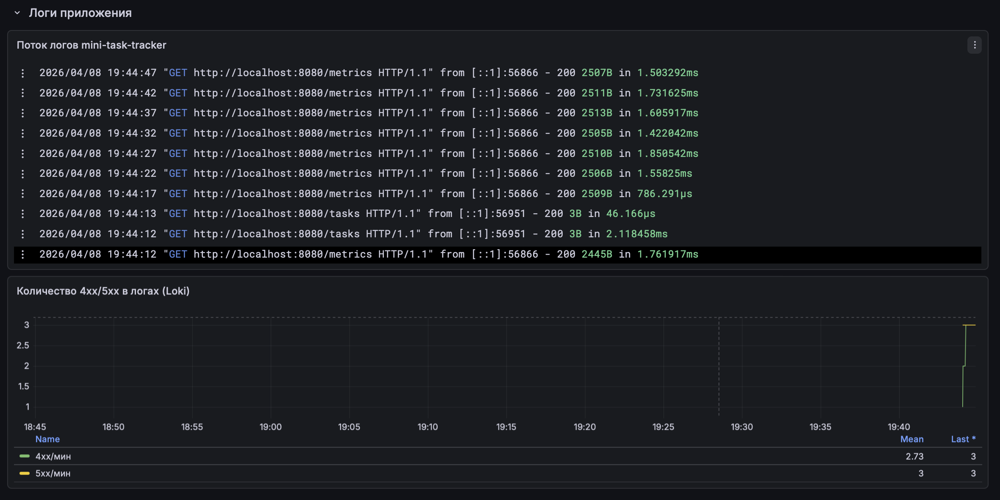
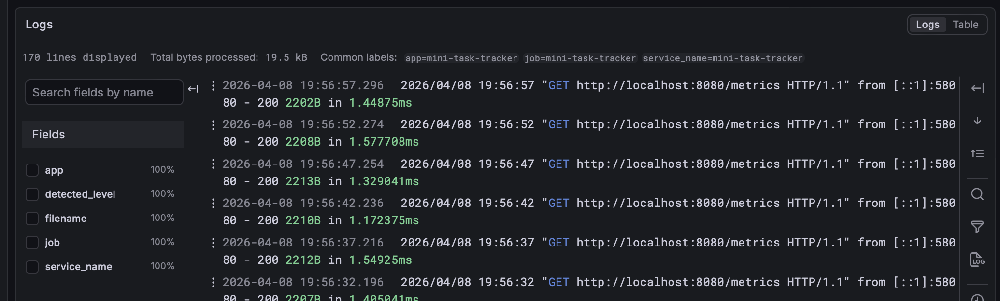
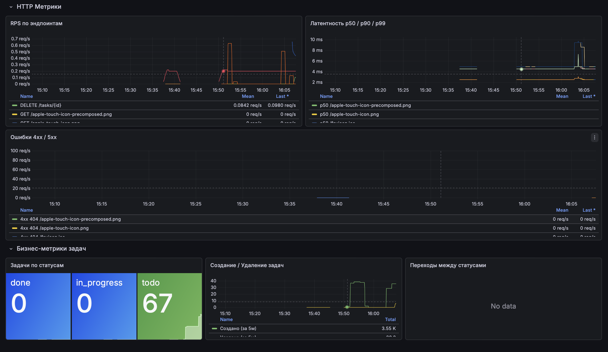

## Отчёт по лабораторной работе №4 (логи + Grafana)

Краткий результат:

- Добавлен экспорт логов приложения в файл `data/logs/app.log`.
- Поднят pipeline логов: `Alloy -> Loki -> Grafana`.
- В Grafana добавлен datasource `Loki` и панели для просмотра/анализа логов.
- Подготовлены примеры LogQL-запросов для фильтрации и агрегации.

Место для скриншота из Grafana (вставите после проверки):






### Реализованный экспорт логов

- Источник логов: stdout приложения + middleware `chi/middleware.Logger`.
- Сохранение логов в файл: `data/logs/app.log` (через `tee` в `scripts/run-all.sh`).
- Сбор логов: `alloy` читает `data/logs/app.log`.
- Хранение/поиск логов: `loki`.
- Визуализация: Grafana (datasource `Loki`, панель `Поток логов mini-task-tracker`).

### Примеры LogQL-запросов

```logql
# Все логи приложения
{job="mini-task-tracker"}

# Только запросы к /tasks
{job="mini-task-tracker"} |= "/tasks"

# Только ошибки 5xx
{job="mini-task-tracker"} |= " 5"

# Количество лог-строк в минуту
sum(count_over_time({job="mini-task-tracker"}[1m]))

# Ошибки 4xx в минуту
sum(count_over_time({job="mini-task-tracker"} |= " 4" [1m]))
```


---

# Mini Task Tracker (API-first проект)


## Описание проекта

Mini Task Tracker — это простой сервис для управления задачами.

Основные цели проекта:

- **API-first подход**: сначала проектируется OpenAPI-спецификация (`openapi.yaml`), потом пишется код.
- **OpenAPI и Swagger UI**.

Сервис умеет:

- Создавать задачи
- Получать список задач
- Получать задачу по ID
- Менять статус задачи
- Удалять задачу

---

## Стек

- Go 1.22+
- `net/http`
- `github.com/go-chi/chi/v5`
- `github.com/swaggo/http-swagger`
- `github.com/prometheus/client_golang` — метрики
- Prometheus — сбор и хранение метрик
- Loki — хранение логов
- Grafana Alloy — сбор и отправка логов в Loki
- Grafana — визуализация дашбордов

---

## Структура проекта

```text
.
├── openapi.yaml
├── README.md
├── go.mod
├── Makefile
├── cmd/
│   └── server/
│       └── main.go
├── internal/
│   ├── handlers/
│   │   └── tasks.go
│   ├── metrics/
│   │   └── metrics.go      # Prometheus-метрики
│   ├── models/
│   │   └── task.go
│   └── storage/
│       └── memory.go
└── configs/
    ├── prometheus.yml       # конфиг Prometheus
    ├── loki.yml             # конфиг Loki
    ├── alloy.config         # конфиг Grafana Alloy
    └── grafana/
        ├── provisioning/
        │   ├── datasources/ # авто-подключение Prometheus и Loki
        │   └── dashboards/  # провайдер дашбордов
        └── dashboards/
            └── tasks.json   # готовый дашборд
```

---

## Как запустить

### Только приложение

1. Установить зависимости:

```bash
go mod tidy
```

2. Запустить сервер:

```bash
go run ./cmd/server
# или через Makefile
make run
```

Сервер поднимется на `http://localhost:8080`.

### Полный стек (приложение + Prometheus + Loki + Alloy + Grafana)

1. Установить инструменты через Homebrew (один раз):

```bash
brew tap grafana/grafana
make install-tools
```

Если ранее был установлен другой пакет `alloy` (не Grafana Alloy), удалите его:

```bash
brew uninstall alloy
```

2. Запустить всё одной командой:

```bash
make run-all
```

Prometheus, Loki, Alloy и Grafana запустятся в фоне, приложение - на переднем плане.
`Ctrl-C` останавливает приложение. Чтобы остановить весь стек:

```bash
make stop
```

Сервисы также можно запустить по отдельности: `make run-prometheus`, `make run-loki`, `make run-alloy`, `make run-grafana`.

---

## Как открыть Swagger UI

После запуска сервера в браузере:

```text
http://localhost:8080/swagger
```

Файл спецификации `openapi.yaml` также доступен по адресу:

```text
http://localhost:8080/openapi.yaml
```

Swagger UI автоматически использует этот файл как источник схемы.

---

## Метрики, логи и мониторинг

### Адреса сервисов

| Сервис | URL |
|---|---|
| Приложение (метрики) | http://localhost:8080/metrics |
| Prometheus | http://localhost:9090 |
| Loki | http://localhost:3100/ready |
| Alloy | http://localhost:12345 |
| Grafana | http://localhost:3000 |

Логин/пароль: `admin` / `admin`.



### Реализованные метрики

**HTTP (инфраструктурные):**

| Метрика | Тип | Лейблы | Описание |
|---|---|---|---|
| `http_requests_total` | Counter | `method`, `path`, `status_code` | Общее число HTTP-запросов |
| `http_request_duration_seconds` | Histogram | `method`, `path` | Время обработки запроса |
| `http_requests_in_flight` | Gauge | — | Запросы в обработке прямо сейчас |

**Продуктовые:**

| Метрика | Тип | Лейблы | Описание |
|---|---|---|---|
| `tasks_total` | Gauge | `status` | Текущее число задач по статусу |
| `tasks_created_total` | Counter | — | Всего создано задач |
| `tasks_deleted_total` | Counter | — | Всего удалено задач |
| `tasks_status_changes_total` | Counter | `from`, `to` | Переходы между статусами |

### Примеры PromQL-запросов

```promql
# RPS по каждому эндпоинту
sum(rate(http_requests_total[1m])) by (method, path)

# Медианная латентность
histogram_quantile(0.50, sum(rate(http_request_duration_seconds_bucket[1m])) by (le))

# p99 латентность по маршруту
histogram_quantile(0.99, sum(rate(http_request_duration_seconds_bucket[1m])) by (le, path))

# Доля ошибок 4xx+5xx
sum(rate(http_requests_total{status_code=~"[45].."}[1m])) / sum(rate(http_requests_total[1m]))

# Текущее число задач по статусам
tasks_total

# Темп создания задач (в час)
rate(tasks_created_total[50m]) * 3600

# Какие переходы статусов происходят чаще всего
topk(5, sum(rate(tasks_status_changes_total[5m])) by (from, to))
```


**Проверить raw-метрики** приложения:

```bash
curl -s http://localhost:8080/metrics | grep -E "^(tasks_|http_requests_total)"
```

**Prometheus** → http://localhost:9090/targets — статус `mini-task-tracker` должен быть **UP**.

**Alloy** → http://localhost:12345 — сервис должен быть доступен.

**Grafana** → http://localhost:3000 → дашборд **Mini Task Tracker** — панели метрик и логов показывают данные.

---

## Модель данных Task

```json
{
  "id": 1,
  "title": "Buy groceries",
  "description": "Milk, bread, eggs",
  "status": "todo",
  "created_at": "2026-02-25T10:00:00Z"
}
```

Поля:

- `id` — целое число (integer), генерируется сервером
- `title` — строка, **обязательное** поле
- `description` — строка, **необязательное** поле
- `status` — строка, одно из значений: `todo`, `in_progress`, `done`
- `created_at` — строка в формате datetime (RFC3339, UTC)
