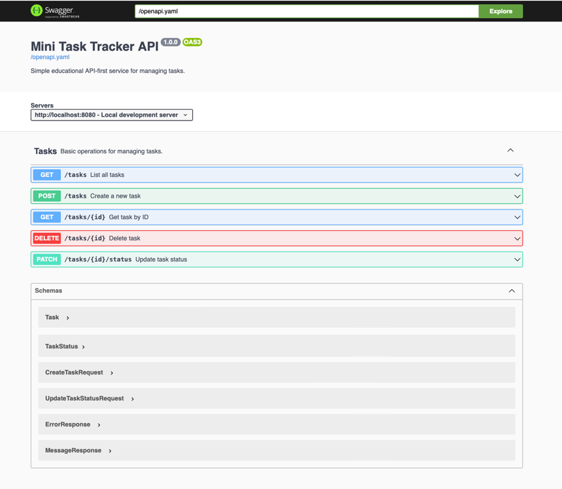

# Mini Task Tracker (API-first проект)



## Описание проекта

Mini Task Tracker — это простой сервис для управления задачами.

Основные цели проекта:

- **API-first подход**: сначала проектируется OpenAPI-спецификация (`openapi.yaml`), потом пишется код.
- **OpenAPI и Swagger UI**.

Сервис умеет:

- Создавать задачи
- Получать список задач
- Получать задачу по ID
- Менять статус задачи
- Удалять задачу

---

## Стек

- Go 1.22+
- `net/http`
- `github.com/go-chi/chi/v5`
- `github.com/swaggo/http-swagger`

---

## Структура проекта

```text
.
├── openapi.yaml
├── README.md
├── go.mod
├── cmd/
│   └── server/
│       └── main.go
├── internal/
│   ├── handlers/
│   │   └── tasks.go
│   ├── models/
│   │   └── task.go
│   └── storage/
│       └── memory.go
└── Makefile
```

---

## Как запустить

1. Установить зависимости (из корня проекта):

```bash
go mod tidy
```

2. Запустить сервер:

```bash
go run ./cmd/server
# или
go run cmd/server/main.go
```

Сервер поднимется на `http://localhost:8080`.

---

## Как открыть Swagger UI

После запуска сервера в браузере:

```text
http://localhost:8080/swagger
```

Файл спецификации `openapi.yaml` также доступен по адресу:

```text
http://localhost:8080/openapi.yaml
```

Swagger UI автоматически использует этот файл как источник схемы.

---

## Модель данных Task

```json
{
  "id": 1,
  "title": "Buy groceries",
  "description": "Milk, bread, eggs",
  "status": "todo",
  "created_at": "2026-02-25T10:00:00Z"
}
```

Поля:

- `id` — целое число (integer), генерируется сервером
- `title` — строка, **обязательное** поле
- `description` — строка, **необязательное** поле
- `status` — строка, одно из значений: `todo`, `in_progress`, `done`
- `created_at` — строка в формате datetime (RFC3339, UTC)
